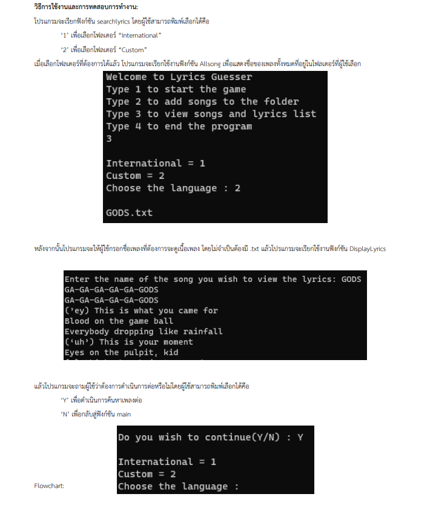

# 🎵 Lyrics Guesser (Console-Based Game)

> **"Can you guess the song from a single line?"**
> A C-based console application that challenges players to identify songs from lyrics, featuring file manipulation and dynamic song management.

---

## 📄 Full Project Report
This repository contains the source code and the detailed project report (including Flowcharts and User Manual).

## https://drive.google.com/file/d/1OFMk9OW2o6Lb7tqYyHVmcXWgMLrJw7n9/view?usp=drive_link
*(Note: Please click the link above to view the detailed documentation)*

---

## 🔍 Project Overview

### 🎯 Objective
To apply fundamental programming concepts (Functions, Pointers, File I/O) to create an interactive game. The program reads song lyrics from text files stored in categorized folders and randomizes questions for the user.

### 🛠️ Key Features
* **Game Mode:** Randomly selects a lyric snippet and asks the user to choose the correct song title.
* **Song Management:** Users can **Add new songs** directly through the console, which creates new `.txt` files in the database.
* **Search System:** Functionality to search for specific lyrics or song titles.
* **File Handling:** Uses `windows.h` API to traverse directories and read song data dynamically.

---

## ⚙️ Logic & Architecture

### Flowchart
The program follows a modular structure, separating the Game Loop, File Reading, and Display Logic.

### Gameplay demo

(Figure 1: Guessing Interface - Player inputs the song title)

### 🚀 How to Run
Note: This program uses windows.h, so it is designed to run on Windows.

Clone this repository.

Compile the code:

Bash

gcc lyricguess.c -o lyrics_guesser.exe
Important: Ensure you have the songs folder with international and custom subfolders in the same directory.

Run the game:

Bash

lyrics_guesser.exe
